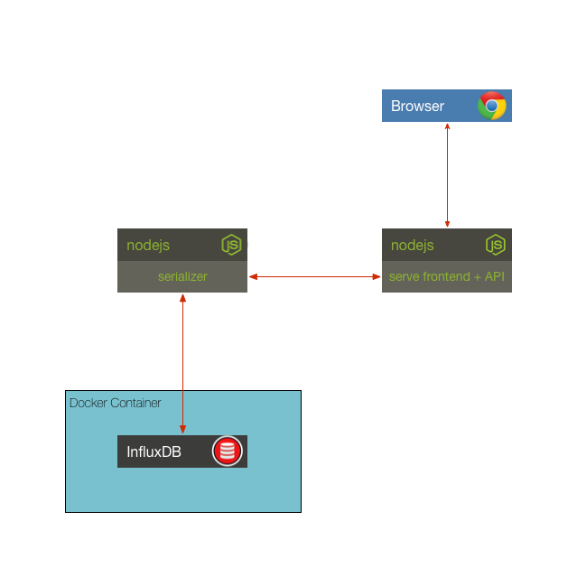

## Solution to Challenge 3

1. The container can be started with the run script `./influx/run.sh`
2. Start the serializer with the required environment variables
  ```sh
  INFLUXDB_HOST=localhost INFLUXDB_USER=root INFLUXDB_PWD=root PORT=10000 node .
  ```
3. execute curl
  ```sh
  curl -X POST -d '{"role": "serialize", "cmd": "write", "type": "temperature", "value": 32}' http://localhost:10000/act  --header "Content-Type: application/json"
  ```
4. Point your browser to [http://localhost:8083/]() to open the influx dashboard and search for the entries you inserted. 
  ```
  select * from temperature
  ```

Stop the container by using the `docker kill` or `docker stop` commands.


## Challenge 4



The next thing we will need to do is to hook-up our frontend to our serialization service in order to read data values for charting.

An updated frontend that talks to the serialization service is provided in _challenge4/frontend_.

Your challenge is to start up InfluxDB, the serialization service, and the frontend (in that order). To do this you will need to write a startup script for the frontend service in the same way as the serialization service.

Once you have these up and running use the _testWrite.sh_ script to send data to the serialization service and see it appear in the frontend.

__hint__ If you look at the updated frontend code you will see that it uses the
following environment variables:

* `SERIALIZER_HOST`
* `SERIALIZER_PORT`
* `PORT` - port for the frontend to listen on

Your script will need to set these values prior to starting the frontend.

## Next Up: [Challenge 5](../challenge5/README.md)
