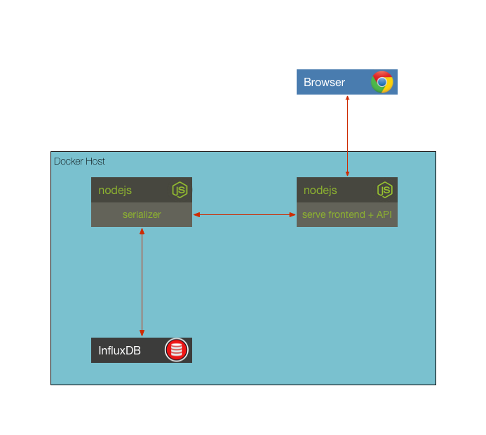

## Solution to Challenge 4

1. InfluxDB can be started with the run script `./influx/run.sh`
2. The serializer can be started with the run script `cd serializer && ./run.sh`
3. Start the frontend with the correct environment variables

```sh
SERIALIZER_HOST=localhost SERIALIZER_PORT=10000 PORT=10001 node .
```

4. Point your browser to [http://localhost:10001/]() to see the chart.
5. Write data to the serializer using the `serializer/testWrite.sh` script.

Stop the container by using the `docker kill` or `docker stop` commands.


## Challenge 5



The number of shell sessions to run our 3 processes is quickly getting out-of-hand. For this challenge `Dockerfile`'s have been added both the `serializer` and `frontend` folders. Your challenge is to build Docker images for the `serializer` and `frontend` then to run them both passing in the required environment variables we used previously.


__hint__ read about the [`docker build`](https://docs.docker.com/engine/reference/commandline/build/) command

__hint__ read about the [`docker run`](https://docs.docker.com/engine/reference/commandline/run/) command


## Next Up: [Challenge 6](../challenge6/README.md)